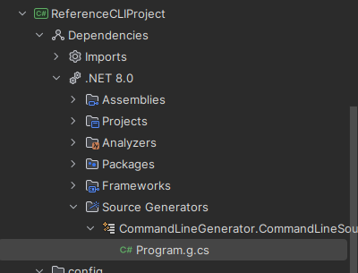

# Command Line Source Generator
## Summary
### Purpose
This project implements boilerplate [C# source code generation](https://learn.microsoft.com/en-us/dotnet/csharp/roslyn-sdk/source-generators-overview) for command line applications which use the [.NET CommandLine APIs](https://learn.microsoft.com/en-us/dotnet/standard/commandline/get-started-tutorial). The intention is that command line app authors only need to write the handlers and underlying business logic, and provide a lightweight JSON configuration file to declare their command, option, and argument structure, and this tool will in the gaps.
### Design
The source generator deserializes the configuration file to a tree structure and then performs a pre-order traversal, visiting each configuration node to generate source code along the way. As it does this, it maintains knowledge of the relationships between each node, and a collection of each command used. It then traverses the relationships to produce parent-child wiring source code, and then finally the flattened command collection to produce handler wiring code.

The code generated above is inserted into a partial class implementation which corresponds to an expected existing
## Features
The following is produced by the source generator:
* Creational code supporting the following inputs for each of these entity types:
    * All entities:
        * Name
        * Description
    * [Commands](https://learn.microsoft.com/en-us/dotnet/api/system.commandline.command):
        * Child Options
        * Child Arguments
        * Child Commands
    * [Options](https://learn.microsoft.com/en-us/dotnet/api/system.commandline.option) and [Arguments](https://learn.microsoft.com/en-us/dotnet/api/system.commandline.argument):
        * Name of type used
        * Arity
    * Options:
        * Optionality
        * Ability to specify multiple arguments per option
    * Arguments:
        * Default value

## Use Guide
This project is not currently vended to NuGet. You can fork and checkout your own copy to get started. There is a sample project file - ReferenceCLIProject - which contains a command configuration file and partially implemented program class.

Modify the command configuration to match the structure of your desired command tree - all command configuration files are expected to contain a single root command json object which has a "Description" and a set of "SubCommands", and you as the CLI implementer are expected to create a handler for each sub-command. Construct the JSON of the command configuration file as if you are directly using the names of constructor arguments and properties for the underlying .NET command line representations, using the [component models](./CommandLineGenerator.Core/ComponentGenerator/Static/Model/) as a reference if there is no clear 1-to-1 match.

After you're done your modifications, you can rebuild the project and should be able to see something similar to the following:

Should you want to make your own project from scratch in the same solution, please reference the package references and additional files in the sample project as you will need these at a minimum.

## Known Limitations and Issues

1. It is not currently possible to register subcommands which do not have an expected handler and are purely structural in nature
2. It is not currently possible to register a root command with a handler
3. Argument default values only support built-in types with literal support
4. There is no way to specify or assume sane defaults in the absence of configuration node properties (e.g. assume all options are of arity 1 unless specified otherwise)
5. Argument and option definitions cannot be re-used as templating is not supported
6. There is no validation to verify naming overlap between components of the same type (e.g. two commands having the same name)
7. There is an uncontracted coupling between the source generators in the assumed identifier convention for commands, options, and arguments.
## Ongoing Work Roadmap
Listed roughly in order of priority:
* Rework the configuration hierarchy model to address 1 and 2
* Implement an identifier knowledge index to address 7
* Validate and prevent overlap of component names to address 6
* Expand high level generator test coverage
* Separate reference project and establish Github CI for releases and publishing to NuGet